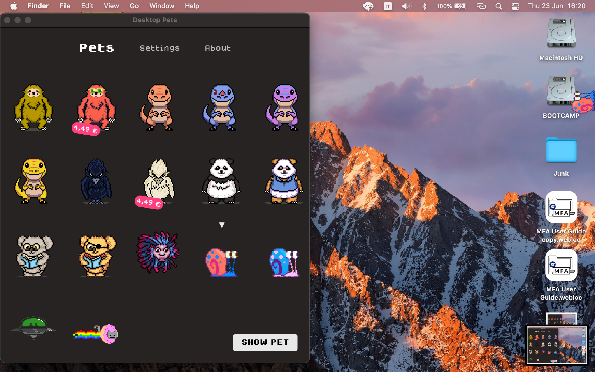

# Desktop Pets

This is the source code for my macOS app [Desktop Pets](https://apps.apple.com/app/desktop-pets/id1575542220)!.

As you can guess, it brings Desktop Pets to macOS 🚀

## What's a Desktop Pet?

It's just a cute little animal that lives in your computer.

The most popular one was probably the [eSheep](https://github.com/Adrianotiger/desktopPet) in Windows 95.

Hope you like them too!

## Screenshots

## Running the Project

1. Download and setup Xcode
1. Open `MacPets` project from this repo
1. There's only one dependency which will be installed via SPM (and many thanks to [LaunchAtLogin](https://github.com/sindresorhus/LaunchAtLogin) maintainers!)
1. That's it!
