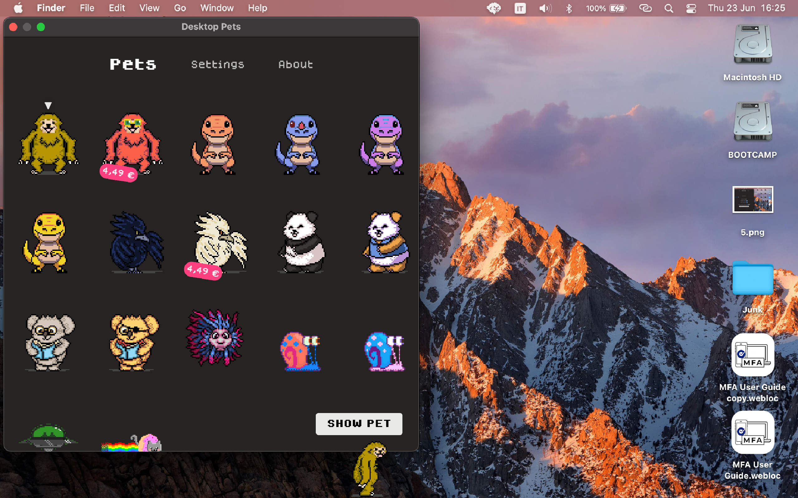
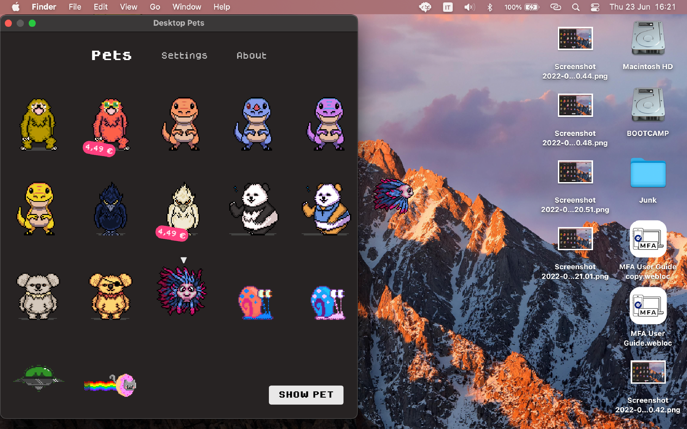

# Desktop Pets

This is the source code of my macOS app [Desktop Pets](https://apps.apple.com/app/desktop-pets/id1575542220)!.

As you can guess, it brings Desktop Pets to macOS 🚀

Like the app? Consider supporting me [via Patreon](https://patreon.com/urinamara?utm_medium=clipboard_copy&utm_source=copyLink&utm_campaign=creatorshare_creator)!

## What's a Desktop Pet?

It's just a cute little pet or animal that lives in your computer.

The most popular one was probably the [eSheep](https://github.com/Adrianotiger/desktopPet) for Windows 95.

Hope you like them too!

## Screenshots

## How does it work?

* [A SwiftUI view renders animations frames](https://github.com/curzel-it/notagif)
* A window with transparent background moves around according to pet state
* [Windows are detected as obstacles](https://github.com/curzel-it/windows-detector)
* A lot of hard work with [Aseprite](https://github.com/aseprite/aseprite)

## Running the Project

1. Download and setup Xcode
1. Open the `PetTherapy` workspace
1. Give Xcode some time to figure out dependencies...
1. Select target 'Desktop Pets' or 'Mobile Pets'
1. Run...

For daily use I recommend getting the App from the App Store.

## Troubleshooting

### Swift Packages not loading
Unfortunately, Xcode does not like local swift packages very much. In case you get any error about missing packages, try the following:
1. Clean build folder (Product > Clean)
1. Reset Packages Cache (Package Dependencies > Right Click)
1. Wait for process completion
1. Close and re-open Xcode
1. Build

