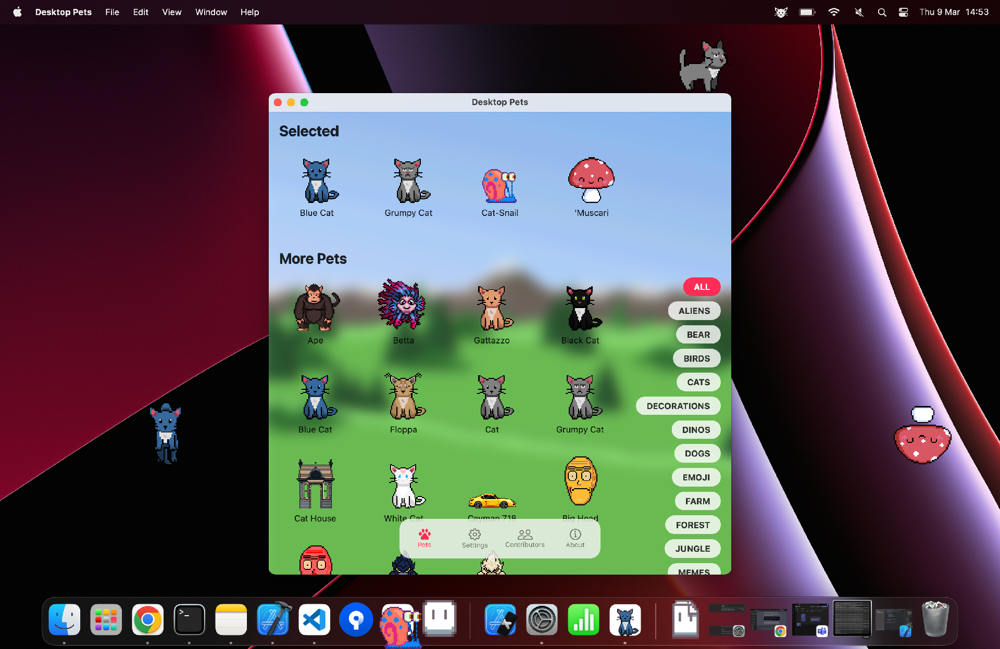
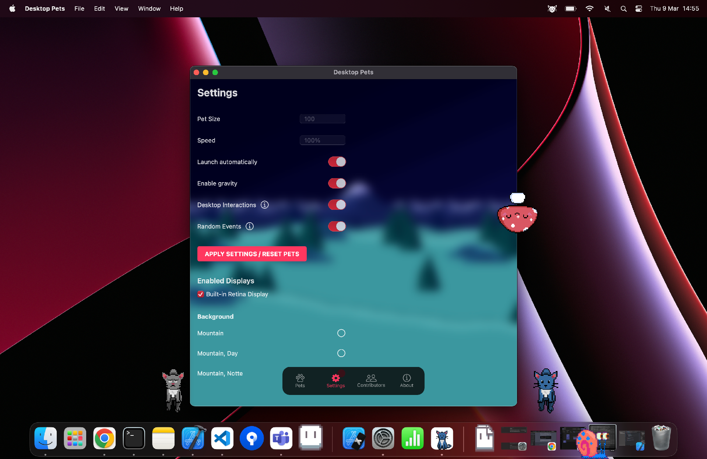
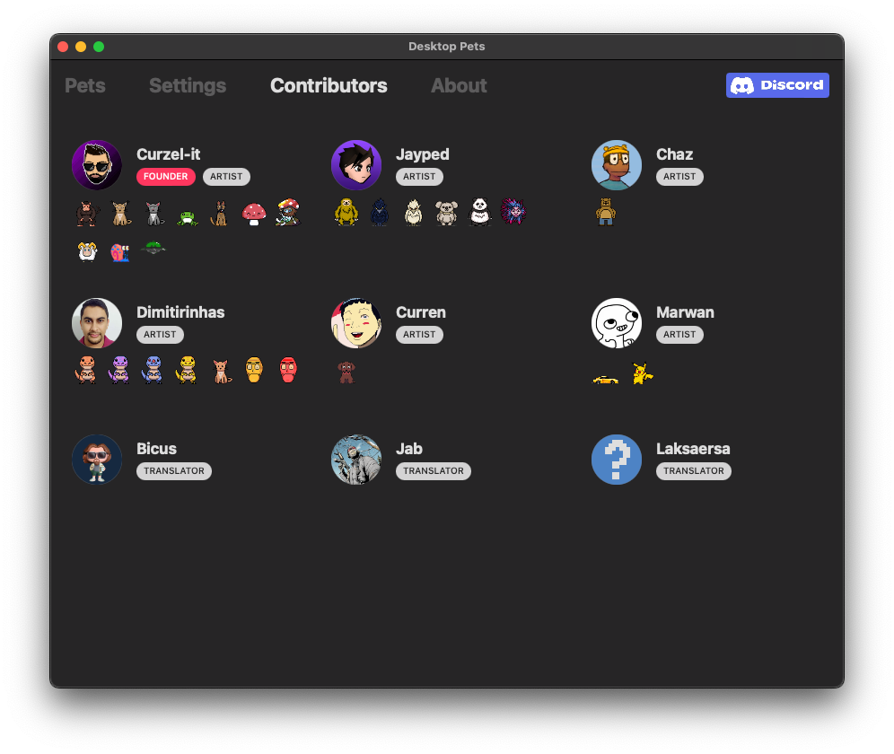

# Desktop Pets

This is the source code of my macOS app [Desktop Pets](https://apps.apple.com/app/desktop-pets/id1575542220)!.

As you can guess, it brings Desktop Pets to macOS 🚀

Like the app? Join our [Discord](https://discord.gg/MCdEgXKSH5)!

## 🎮 Supported Systems
The app is currently available for macOS and iOS (with slightly different features).

I'm working on a [Python port](https://github.com/curzel-it/pet-therapy/tree/main/Sources/windows/README.md) using Qt, which will be targeting Windows and Linux systems.

## 🤔 What's a Desktop Pet?

It's just a cute little pet or animal that lives in your computer.

The most popular one was probably the [eSheep](https://github.com/Adrianotiger/desktopPet) for Windows 95.

Hope you like them too!

## 📲 Get the app
For daily use I recommend getting the App from the App Store.

Alternatively, you can download the latest release from [GitHub]( https://github.com/curzel-it/pet-therapy/releases/latest) or build from source (see below).

[](https://apps.apple.com/app/desktop-pets/id1575542220)

## 🔥 Screenshots




## 🎨 Create custom pets

Starting from version 2.20 you can now create custom pets, please check [the documentation](https://curzel.it/pet-therapy/custompets).

You do not need any programming knowledge or Xcode to create your own pets, just design your characters and follow [the instructions](https://curzel.it/pet-therapy/custompets), good luck!

## 🙏 Contribute

Contributors get a shout out in the app, just saying... 😏


If you wish to improve support for your language, join our [Discord](https://discord.gg/MCdEgXKSH5) and let us know!

## 🔔 Interoperability

Since version 2.48 you can use `DistributedNotificationCenter` to send basic commands to your pets.

Here's the payload:

```json
{
    # Species id
    "subject": "sloth",
    
    # Animation id
    "action": "eat",
    
    # Optional, both x and y required 
    "x": 100,
    "y": 100
}
```

Sample Python script to send out notifications:
```python
from Foundation import NSDistributedNotificationCenter, NSDictionary

def send_notification():
    notification_name = "it.curzel.pets.Api"
    message = {...}
    user_info = NSDictionary.dictionaryWithDictionary_(message)
    center = NSDistributedNotificationCenter.defaultCenter()
    center.postNotificationName_object_userInfo_deliverImmediately_(
        notification_name, None, user_info, True
    )

if __name__ == "__main__":
    send_notification()
```

## 🛠️ Build from Source
1. Download and setup Xcode
1. Open the `Sources/macOS/DesktopPets.xcworkspace`
1. Give Xcode some time to figure out dependencies...
1. Run
