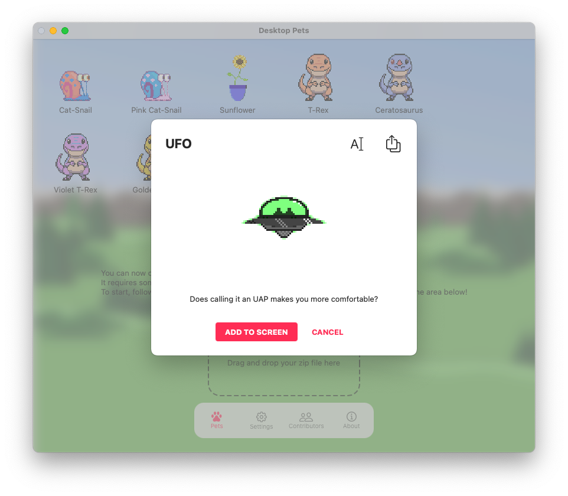
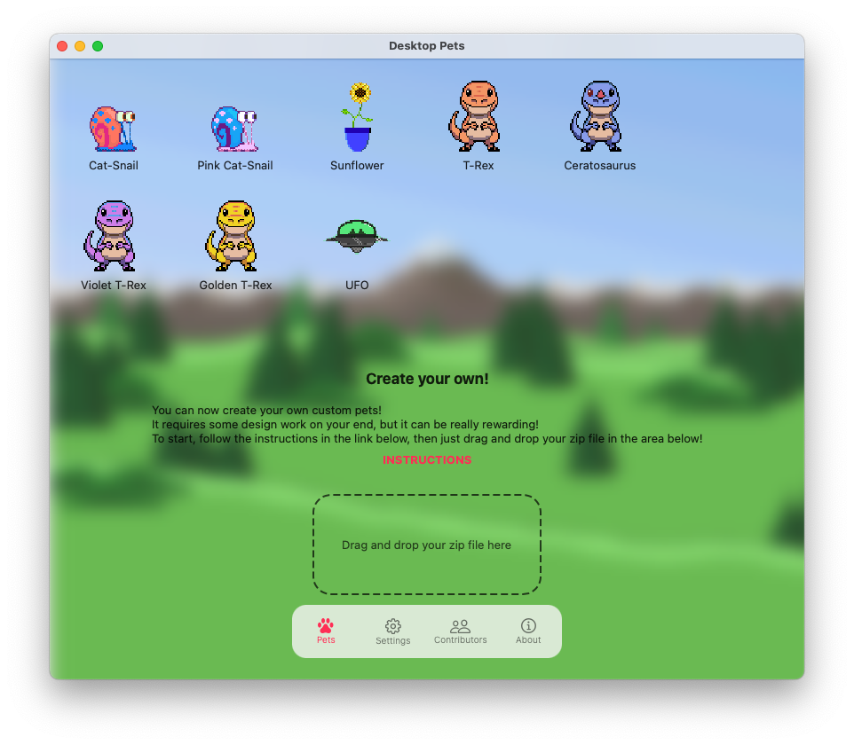

# Custom Pets

You can now create your own custom pets!

## TLDR;
1. Click on a pet you like and export it (see below)
1. Modify the json file the sprites as you see fit
1. Double check filename (see [sprites section](#sprites))
1. Zip everything
1. Drag and drop the zip in the app
1. Show and share your work on [Discord](https://discord.gg/WvvnmPCy)!

I've also made a (terrible) tutorial, you can find it [on YouTube](https://www.youtube.com/watch?v=Mj4U2GIF8MA)! 

## Breaking changes in version 2.40
...Sorry!

### Explicit Capabilities
Starting with version 2.40, certain capabilities are not added by the app automatically anymore.

These are:
* `Gravity` - Allows pets to fall to the bottom of the screen
* `RandomPlatformJumper` - Allows pets to fly on top of windows
* `Draggable` - Allows pets to be dragged with the mouse
* `ShowsMenuOnRightClick` - Allows pets to be right-clicked to open a menu

Updating your custom pets is very easy:
1. Export them from the app
1. Delete them from the app
1. Edit the json file and add the new items to the list of capabilities
1. Re-import the pet
1. Done!

See [Species Definition](#species definition) for an example.

### Animation Position
Starting with version 2.40, the app will stop supporting the legacy format of the `position` parameter.

Updating is easy, just change your animations position from the old format:
``` json
"position": { "fromEntityBottomLeft": {} },
```
To the new one:
``` json
"position": "fromEntityBottomLeft",
```

You will need to delete your pet from the app and re-import it.

## Setup
You only need two things: 
* An updated version of the app
* Some tool do design your own sprites (I use [Aseprite](https://github.com/aseprite/aseprite), but any other will work just fine!)

Building the app from source it's not required for creating custom pets, but you can build the app using Xcode if you want, here are [some instructions](https://github.com/curzel-it/pet-therapy) for that. 

## Species Definition
A `Species` is defined by the following: 
* A unique id
* A list of Capabilities
* A list of Animations
* Other attributes, such as speed

All of these need to be defined in a json file, for example:

``` json
{
  "id": "ape",
  "dragPath": "drag",
  "fps": 10,
  "zIndex": 0,
  "tags": ["jungle"],
  "movementPath": "walk",
  "speed": 0.7,
  "capabilities": [
    "AnimatedSprite",
    "AnimationsProvider",
    "AnimationsScheduler",
    "AutoRespawn",
    "BounceOnLateralCollisions",
    "Draggable",
    "FlipHorizontallyWhenGoingLeft",
    "Gravity",
    "LinearMovement",
    "PetsSpritesProvider",
    "Rotating",
    "ShowsMenuOnRightClick"
  ],
  "animations": [
    {
      "id": "front",
      "position": "fromEntityBottomLeft",
      "requiredLoops": 5
    },
    ...
  ]
}
```

Complete json files for all original species can be found [here](https://github.com/curzel-it/pet-therapy/tree/main/Species).

### Capabilities
Capabilities are behaviors that can be attached to a Pet to manipulate its state on update - some names are pretty self-explanatory, such as `BounceOnLateralCollisions`, `FlipHorizontallyWhenGoingLeft` or `Gravity`.

While I recommend using the set of capabilities in the example above for most pets, not all species have the same capabilities:
* Grumpy Cat has a special one called `GetsAngryWhenMeetingOtherCats`
* Snails are missing `BounceOnLateralCollisions` and have a special one called `WallCrawler`, which is what makes them "crawl" along the borders of your screen
* `RandomPlayformJumper` allows certain pets to "fly" to other windows on your screen

### Animations
Animations are picked randomly from the list at a random interval.

Each animation has: 
* `id` which determinates the sprite to be rendered
* `position` 
* `size` see sloth's [lightsaber animation](https://github.com/curzel-it/pet-therapy/blob/main/Species/sloth.json)
* `requiredLoops` number of times the animation will be repeated

Each species needs to have at least a `front` animation, which is loaded in homepage and pet details.

### Other properties
* `movementPath` determinates which sprite set should be used to render the movement animation (usally `walk` or `fly`)
* `dragPath` determinates which sprite set should be used to render the "falling" and "drag" animations (usally `drag` or `front`)
* `speed` is self-explanatory
* `fps` animations in some species are *slower* (such as snail or the sunflower), so no need to render them as fast

## Sprites

Each animations is composed of multiple sprites, each in a dedicated `png` image file.

Each file **must** follow this convention: 

`{species.id}_{animation.id}-{index}.png`.

Indeces can either start from 0 or 1, but need to follow an incremental and sequential order. Names are also case-sensitive.

For example:
* `ape_front-1.png`
* `ape_front-2.png`
* `ape_front-3.png`
* `ape_front-4.png`
* `ape_walk-0.png`
* `ape_walk-1.png`
* `ape_walk-2.png`
* `ape_walk-3.png`
* `sloth_swag_lightsaber-0.png`
* ...

To get you quickstarted, you can take a look at the [Aseprite files](https://github.com/curzel-it/pet-therapy/tree/main/Aseprite) for my pets!

Aseprite is a great tool, more info [here](https://github.com/aseprite/aseprite).

## Animation Duracy

All animations of a given species must have the same number of frames per second.

In the json file, you change the `fps` property to set framerate.

In order to save battery and processing power, the maximum frame rate is set to 20 fps.

I recommend sticking to 10 fps, or 100 milliseconds per frame.

## App Features
### Export
Click on any pet to show its details, then click the button in the top right.


### Import
Scroll down the list of pets and drop in the designated area.

